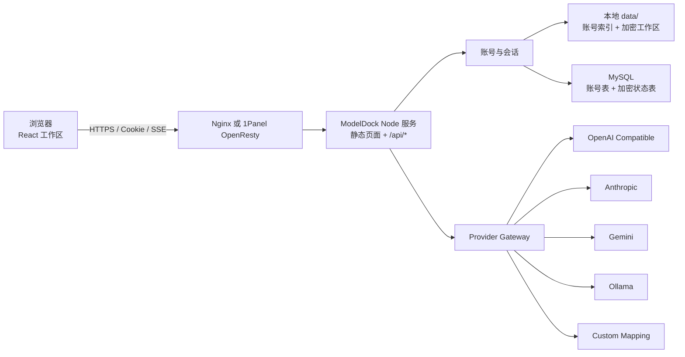

# ModelDock

ModelDock 是一个用于统一连接、管理和调用多种 AI API 的多账号聊天工作台。它把模型目录、API 端点、聊天记录、多模态附件、图片生成/编辑、深度思考和界面外观集中在同一个 Web 应用中。

项目采用 React + TypeScript 构建前端，Node.js + TypeScript 提供账号、存储、模型适配和流式聊天接口。开发环境由 Vite 提供页面，生产环境由 Node 进程同时提供前端静态文件与 `/api/*` 接口。

> 当前仓库未附带开源许可证。公开可见不代表自动授予复制、修改或分发权限。

## 目录

- [界面与功能](#界面与功能)
- [支持的模型接口](#支持的模型接口)
- [多模态文件支持](#多模态文件支持)
- [系统架构](#系统架构)
- [快速开始](#快速开始)
- [配置文件](#配置文件)
- [环境变量](#环境变量)
- [API 端点与自定义映射](#api-端点与自定义映射)
- [本地文件存储](#本地文件存储)
- [MySQL 存储](#mysql-存储)
- [从本地文件迁移到 MySQL](#从本地文件迁移到-mysql)
- [生产环境部署](#生产环境部署)
- [1Panel 部署](#1panel-部署)
- [备份、升级与恢复](#备份升级与恢复)
- [命令速查](#命令速查)
- [常见问题](#常见问题)
- [项目结构](#项目结构)

## 界面与功能

### 登录与账号

- 未登录时只能进入登录/注册页，不能访问聊天工作区。
- 登录页支持注册新账号、登录已有账号以及浅色/深色模式。
- 账号名长度为 3–32 个字符，可使用文字、数字、点、短横线和下划线。
- 密码长度为 8–128 个字符。
- 每个账号分别保存自己的 API 配置、模型目录、映射模板、聊天记录、主题和背景效果参数。
- 左下角账号菜单可以修改密码或退出登录。
- 修改密码时会重新加密该账号的工作区数据，并注销该账号的旧会话。

密码只保存 scrypt 摘要。账号工作区使用登录密码派生的密钥进行 AES-256-GCM 加密，API Key、模型配置、主题参数和聊天记录都包含在加密工作区中。登录后派生密钥仅存在于服务端内存会话中；服务重启后需要重新登录。

> 忘记密码后无法恢复工作区内容。部署前应建立可靠的备份策略。

### 聊天工作区

- 按已启用的 API 端点分组切换模型。
- 只显示在当前 API 配置中勾选为可用的模型。
- 使用 HTTP + SSE 流式显示模型回答。
- 支持停止生成、复制回答、重新生成最后一条回答。
- 只允许编辑并重发最后一条用户提示词；文字和附件会一起恢复，重发后替换该提示词及其后续回答。
- Markdown 使用 GitHub Flavored Markdown 渲染，兼容表格、列表、任务列表、代码块等常见 README 格式。
- 模型输出的图片显示在聊天记录中；点击图片会打开全图预览，下载操作位于预览窗口内。
- 模型目录启用“深度思考模式”后，聊天输入框会出现“深度思考”按钮。
- 深度思考按钮关闭时，适配器会显式请求直接回答；打开时会请求推理内容并在回答上方独立显示。
- 对支持本地 `<think>` 标签或独立 reasoning 字段的接口，会把思考过程与最终答案分开保存和展示。

### 历史聊天记录

- 左侧栏按更新时间显示聊天记录和最近使用的模型/API。
- 可按标题、正文预览、模型名或 API 名称搜索。
- 历史记录分页显示。
- 支持进入批量管理模式，多选并一次删除多条记录。
- 每个账号只会看到自己的聊天记录。

### API 连接页

- 可添加、修改、删除、启用或停用多个 API 端点。
- API 端点支持拖动排序，也可使用 `Alt + ↑/↓` 键盘排序。
- 每个端点可以设置独立的名称、识别颜色、请求格式、Base URL 和 API Key。
- 可测试连接并读取目标接口返回的模型数量。
- 可从统一模型目录中勾选此端点实际可用的模型。
- API Key 不会写入映射模板；模板只保存端点地址和请求/响应映射。

### 模型目录页

- 模型分组和目录模型均可新增、删除、修改和拖动排序。
- 分组可设置名称、协议类型、简介和识别颜色。
- 模型可设置：
  - 界面显示名称
  - API 调用名
  - 所属分组
  - 上下文说明
  - 能力标签
  - 模型简介
  - 文本、图像、视频、音频输入类型（可多选）
  - 深度思考模式支持开关
- 删除目录模型时，会同步从各 API 端点的可用模型列表中移除。
- 聊天页的附件选择器会根据当前模型声明的输入类型自动限制文件格式。

新账号默认带有五个可编辑分组：OpenAI、Anthropic、Gemini、DeepSeek 和 Ollama。预置的模型名称与调用名只是初始目录数据，实际是否可用取决于所连接 API 的模型支持情况。

### 请求映射模板

自定义协议支持“手动配置”和“映射模板”两种方式。模板可以新增、修改、另存和删除，并保存当前 Base URL、推荐模型与全部映射字段。

新账号默认包含四个 OpenAI 官方模板：

1. OpenAI Image API 生图
2. OpenAI Responses API 生图
3. OpenAI Image API 编辑图
4. OpenAI Responses API 编辑图

选择“不使用模板”不会清空当前配置，可以继续单独修改并只保存到当前 API 端点。
已有账号会原样保留自己已经保存的模板；升级不会自动删除或补充模板。

### 外观与交互

- 浅色、深色模式。
- Lime、Blue、Violet、Orange、Rose、Cyan 六套主题色。
- 登录页、加载页和工作区会继承账号最近保存的明暗模式与主题设置。
- 高级外观设置提供实时预览，可统一开关或单独控制：
  - 粒子密度与不透明度
  - 粒子连线距离与不透明度
  - 鼠标区域半径、避让强度、连接距离与连接不透明度
  - 网格不透明度、尺寸与线宽
  - 轨道不透明度与速度
  - 雾化背景不透明度
  - 扫描光线不透明度与速度
- 特效颜色可以跟随主题，也可以使用自定义颜色。
- 支持减少动态效果的系统偏好。

### 快捷命令

点击顶部命令按钮或按 `Ctrl + /` 打开快捷命令，可快速：

- 新建聊天
- 聚焦历史搜索
- 打开 API 连接页
- 打开模型目录
- 切换界面主题

### 管理员界面

- 管理入口为 `/admin`，主界面中不显示跳转入口。
- 管理员账号名由 `config.json` 的 `adminUsername` 或环境变量 `MODELDOCK_ADMIN_USERNAME` 指定。
- 管理员必须先在普通注册页创建同名账号，然后才能在 `/admin` 使用同一账号密码登录。
- 管理员可以搜索、查看和删除其他账号。
- 管理员自身受保护，不能在管理界面删除。
- 删除普通账号会永久删除其账号记录、API 配置、模型目录和全部聊天记录，无法撤销。

## 支持的模型接口

| 请求格式 | 模型列表 | 聊天端点 | 鉴权方式 | 说明 |
| --- | --- | --- | --- | --- |
| OpenAI Compatible | `GET /models` | `POST /chat/completions` | `Authorization: Bearer <key>` | 兼容 OpenAI、DeepSeek 及多数 OpenAI-compatible 中转接口 |
| Anthropic | `GET /v1/models` | `POST /v1/messages` | `x-api-key` | 自动使用 `anthropic-version: 2023-06-01`，支持 thinking 流 |
| Google Gemini | `GET /v1beta/models` | `POST /v1beta/models/{model}:streamGenerateContent` | API Key | 支持 `contents/parts` 多模态结构和 thinkingConfig |
| Ollama | `GET /api/tags` | `POST /api/chat` | 通常不需要 | 支持本机或内网 Ollama、图像输入和 `think` 参数 |
| Custom | 自定义 | 自定义 | 自定义 Header/前缀 | 支持 JSON、Multipart、SSE、NDJSON 和单次 JSON |

Base URL 应填写协议根地址，不要重复填写上表中的相对路径。例如：

- OpenAI Compatible：`https://api.openai.com/v1`
- Anthropic：`https://api.anthropic.com`
- Gemini：`https://generativelanguage.googleapis.com`
- Ollama：`http://127.0.0.1:11434`

> 如果 ModelDock 部署在容器中，`127.0.0.1` 指向 Node 容器自身，不是宿主机。连接宿主机 Ollama 时应使用可从容器访问的宿主机地址或主机映射。

## 多模态文件支持

模型目录中的输入类型决定聊天页允许选择的文件类型。

| 类型 | 支持格式 |
| --- | --- |
| 文本 | TXT、Markdown、JSON/JSONL、CSV/TSV、PDF、HTML、CSS、XML、YAML、JavaScript/TypeScript、Python、Java、Go、Rust、SQL 等 |
| 图像 | PNG、JPEG、WebP、GIF、AVIF |
| 视频 | MP4、WebM、MOV、MKV |
| 音频 | MP3、WAV、OGG、M4A/MP4、WebM、FLAC |

限制：

- 单个附件最大 12 MiB。
- 单条消息最多 6 个附件。
- 单条消息附件总大小最大 18 MiB。
- 附件会作为账号聊天记录的一部分保存，因此大量 Base64 文件会显著增加本地文件或 MySQL `LONGBLOB` 的体积。
- 不同上游 API 对格式和大小还有自己的限制；ModelDock 的允许列表不代表目标模型一定接受该文件。

## 系统架构



生产构建会生成：

- `dist/`：React 前端静态文件。
- `dist-server/`：编译后的 Node.js 服务端。

运行 `pnpm start` 后，Node 服务从同一端口提供这两个部分；Nginx 只需要把整个站点反向代理到 Node 应用端口。

## 快速开始

### 环境要求

- Node.js 24（推荐；代码也兼容满足 Vite 要求的较新 Node.js 版本）
- pnpm
- Windows、Linux 或 macOS
- MySQL 模式需要可连接的 MySQL 数据库

### 安装 pnpm

如果系统提供 Corepack：

```bash
corepack enable
corepack prepare pnpm@latest --activate
```

也可以使用 npm：

```bash
npm install -g pnpm
```

Windows PowerShell 如果因为脚本执行策略无法运行 `npm.ps1`，直接调用：

```powershell
& "C:\Program Files\nodejs\npm.cmd" install -g pnpm
```

Node.js 安装位置不同时，请将路径替换为实际的 `npm.cmd`。

### 创建本地配置

Linux/macOS：

```bash
cp config.example.json config.json
```

Windows PowerShell：

```powershell
Copy-Item config.example.json config.json
```

`config.json` 已加入 `.gitignore`，不会被提交到 Git。

### 启动开发环境

```bash
pnpm install
pnpm dev
```

默认地址：

- Web：`http://127.0.0.1:4173`
- API：`http://127.0.0.1:3000`
- 健康检查：`http://127.0.0.1:3000/api/health`
- 管理入口：`http://127.0.0.1:4173/admin`

`pnpm dev` 会先编译服务端，然后同时以前台方式运行 Node API 和 Vite。按 `Ctrl + C` 可以同时停止两者。

Windows 还提供后台启动命令：

```powershell
pnpm dev:background
```

该命令会检查 3000/4173 端口，并只启动尚未运行的部分。日常开发更推荐使用前台的 `pnpm dev`，便于直接查看错误日志和停止服务。

## 配置文件

ModelDock 启动时必须能在项目运行目录读取 `config.json`。最小配置可以直接复制 `config.example.json`。

```json
{
  "onlineMode": false,
  "adminUsername": "admin",
  "dataDirectory": "./data",
  "mysql": {
    "host": "127.0.0.1",
    "port": 3306,
    "database": "modeldock",
    "user": "modeldock",
    "passwordEnvironmentVariable": "MODELDOCK_MYSQL_PASSWORD"
  },
  "server": {
    "host": "127.0.0.1",
    "port": 3000,
    "sessionHours": 24,
    "secureCookies": false,
    "allowedOrigins": [
      "http://127.0.0.1:4173",
      "http://localhost:4173"
    ]
  }
}
```

### 顶层参数

| 参数 | 类型 | 默认值 | 说明 |
| --- | --- | --- | --- |
| `onlineMode` | boolean | `false` | `false` 使用本地文件；`true` 使用 MySQL |
| `adminUsername` | string | `admin` | 唯一管理员账号名，大小写比较不敏感；需要先注册同名账号 |
| `dataDirectory` | string | `./data` | 本地文件模式的数据目录；相对路径以项目运行目录为基准 |

### `mysql` 参数

| 参数 | 类型 | 默认值 | 说明 |
| --- | --- | --- | --- |
| `mysql.host` | string | `127.0.0.1` | MySQL 主机名或 IP；容器部署时通常填写数据库容器名或内网地址 |
| `mysql.port` | integer | `3306` | MySQL 端口，必须在 1–65535 之间 |
| `mysql.database` | string | `modeldock` | 已提前创建的数据库名 |
| `mysql.user` | string | `modeldock` | 数据库用户 |
| `mysql.passwordEnvironmentVariable` | string | `MODELDOCK_MYSQL_PASSWORD` | 保存数据库密码的环境变量名称；配置文件不直接保存密码 |

### `server` 参数

| 参数 | 类型 | 默认值 | 说明 |
| --- | --- | --- | --- |
| `server.host` | string | `127.0.0.1` | Node 监听地址。本机反代可使用 `127.0.0.1`；容器中通常使用 `0.0.0.0` |
| `server.port` | integer | `3000` | Node 应用端口，必须在 1–65535 之间 |
| `server.sessionHours` | number | `24` | 登录会话有效时长，单位为小时；会话保存在内存中 |
| `server.secureCookies` | boolean | `false` | HTTPS 生产环境应设为 `true`，使登录 Cookie 带 `Secure` 属性 |
| `server.allowedOrigins` | string[] | 本地 Vite 地址 | 允许跨来源调用 API 的完整 Origin，例如 `https://example.com`，不带末尾路径 |

配置优先级为：受支持的环境变量 > `config.json` > 程序默认值。

## 环境变量

| 环境变量 | 覆盖的配置 | 示例 |
| --- | --- | --- |
| `MODELDOCK_ONLINE_MODE` | `onlineMode` | `true` |
| `MODELDOCK_ADMIN_USERNAME` | `adminUsername` | `admin` |
| `MODELDOCK_DATA_DIRECTORY` | `dataDirectory` | `/var/lib/modeldock` |
| `MODELDOCK_MYSQL_HOST` | `mysql.host` | `mysql` |
| `MODELDOCK_MYSQL_PORT` | `mysql.port` | `3306` |
| `MODELDOCK_MYSQL_DATABASE` | `mysql.database` | `modeldock` |
| `MODELDOCK_MYSQL_USER` | `mysql.user` | `modeldock` |
| `MODELDOCK_MYSQL_PASSWORD` | 数据库密码 | 使用强随机密码 |
| `MODELDOCK_SERVER_HOST` | `server.host` | `0.0.0.0` |
| `MODELDOCK_SERVER_PORT` | `server.port` | `3000` |
| `MODELDOCK_SECURE_COOKIES` | `server.secureCookies` | `true` |

如果修改了 `mysql.passwordEnvironmentVariable`，实际环境变量名也要随之修改。例如设置为 `DB_PASSWORD` 后，程序会读取 `DB_PASSWORD`，而不是 `MODELDOCK_MYSQL_PASSWORD`。

当前 `server.sessionHours` 和 `server.allowedOrigins` 没有环境变量覆盖项，需要写入 `config.json`。

布尔环境变量只接受字符串 `true` 或 `false`。

## API 端点与自定义映射

### 通用 API 配置

| 字段 | 说明 |
| --- | --- |
| 配置名称 | 仅用于 ModelDock 界面显示 |
| 请求格式 | OpenAI Compatible、Anthropic、Gemini、Ollama 或 Custom |
| 识别颜色 | API 列表、模型切换器等位置使用的颜色 |
| Base URL | API 根地址；适配器会在其后追加协议路径 |
| API Key | 当前端点的鉴权密钥；本地无鉴权服务可以留空 |
| 启用状态 | 停用后不会出现在聊天页模型切换器中 |
| 可用模型 | 从账号模型目录中勾选此端点能够调用的模型 |

### 自定义映射路径规则

- 字段路径使用点号分隔，例如 `choices.0.delta.content`。
- 数组项使用数字下标，例如 `output.0.result`。
- 不使用的可选字段可以留空。
- Base URL 与相对路径会自动拼接。
- 映射模板不会保存 API Key。

### 请求构造参数

| 字段 | 默认值 | 说明 |
| --- | --- | --- |
| `chatPath` | `chat/completions` | 聊天、生成或编辑请求相对路径 |
| `authHeader` | `Authorization` | API Key 所在 Header；留空则不发送 |
| `authScheme` | `Bearer` | API Key 前缀；不需要前缀时留空 |
| `requestModelField` | `model` | 模型调用名写入的路径 |
| `requestMessagesField` | `messages` | 消息、prompt 或 input 写入的路径 |
| `requestMessagesMode` | `messages` | 完整消息数组、最后用户文本、最后消息文本、拼接用户文本或 OpenAI Responses 图文输入 |
| `requestEncoding` | `json` | `json` 或 `multipart`；图片编辑上传通常使用 Multipart |
| `requestAttachmentsField` | 空 | Multipart 附件字段，如 `image` 或 `image[]` |
| `requestStreamField` | `stream` | 流式开关字段；非流式接口留空 |
| `requestTemperatureField` | `temperature` | Temperature 字段；不支持时留空 |
| `requestMaxTokensField` | `max_tokens` | 最大输出 Token 字段，支持嵌套路径 |
| `requestReasoningField` | 空 | 深度思考开关字段，例如 `thinking.type` 或 `think` |
| `requestReasoningEnabledJson` | `"enabled"` | 开启值，可填写字符串、布尔值、数字或 JSON 对象 |
| `requestReasoningDisabledJson` | `"disabled"` | 关闭值，可填写字符串、布尔值、数字或 JSON 对象 |
| `requestBodyJson` | `{}` | 固定附加字段；JSON 请求直接合并，Multipart 请求转为表单字段 |
| `streamProtocol` | `sse` | 响应协议：`sse`、`ndjson` 或 `json` |

### 响应解析参数

| 字段 | 默认值 | 说明 |
| --- | --- | --- |
| `responseDeltaPath` | `choices.0.delta.content` | 文本增量或最终文本路径 |
| `responseReasoningPath` | `choices.0.delta.reasoning_content` | 独立思考内容路径 |
| `responseAttachmentsPath` | `choices.0.delta.attachments` | 附件对象或附件数组路径 |
| `responseAttachmentDataPath` | `data` | Base64 附件数据路径 |
| `responseAttachmentUrlPath` | `url` | 附件 URL 路径 |
| `responseAttachmentMimeTypePath` | `mime_type` | 响应中的 MIME 类型路径 |
| `responseAttachmentMimeTypeValue` | 空 | 响应不提供 MIME 时使用的固定值，如 `image/png` |
| `responseAttachmentNamePath` | `name` | 响应中的文件名路径 |
| `responseAttachmentNameValue` | 空 | 响应不提供文件名时使用的固定值 |

### 模型目录与 Header 参数

| 字段 | 默认值 | 说明 |
| --- | --- | --- |
| `modelsPath` | `models` | 模型列表相对路径 |
| `responseModelsPath` | `data` | 模型数组在响应中的路径 |
| `responseModelIdPath` | `id` | 单个模型调用名路径 |
| `headersJson` | `{}` | 目标接口要求的额外 Header JSON |

### 图片生成映射示例

类似 OpenAI Image API 的 JSON 生图接口可以使用：

```text
Base URL: https://api.example.com/v1
聊天路径: images/generations
模型请求字段: model
消息请求字段: prompt
消息取值方式: 最后一条用户文本
请求编码: JSON
流式开关字段: 留空
响应协议: 单次 JSON
附件数组响应路径: data
附件数据字段路径: b64_json
附件 URL 字段路径: url
附件 MIME 固定值: image/png
附件名称固定值: generated-image.png
```

图片编辑接口通常把请求编码改为 Multipart，并把上传附件字段设为目标接口要求的 `image` 或 `image[]`。

## 本地文件存储

设置：

```json
{
  "onlineMode": false,
  "dataDirectory": "./data"
}
```

首次启动会自动创建：

```text
data/
├── accounts.json
└── users/
    └── <account-uuid>/
        └── state.enc.json
```

- `accounts.json` 保存账号名、密码摘要、派生参数和时间信息。
- `state.enc.json` 保存经过 AES-256-GCM 加密的完整账号工作区。
- 修改密码时使用临时事务文件，启动时会自动恢复未完成的密码轮换。
- 文件以原子替换方式写入，尽量避免写入中断留下半份状态。

本地模式适合个人使用、开发测试或单实例部署。不要让多个 ModelDock 进程同时写入同一个 `dataDirectory`。

## MySQL 存储

MySQL 模式适合服务器部署或需要把账号数据放入数据库的场景。应用会自动创建以下表：

| 表 | 用途 |
| --- | --- |
| `modeldock_accounts` | 账号名、密码摘要、派生参数和创建/更新时间 |
| `modeldock_account_states` | 账号工作区的 AES-256-GCM 密文及版本号 |
| `modeldock_data_migrations` | 文件到 MySQL 迁移记录，避免重复导入 |

### 创建数据库和用户

以下示例需要由 MySQL 管理员执行，请替换密码和允许连接的主机范围：

```sql
CREATE DATABASE modeldock
  CHARACTER SET utf8mb4
  COLLATE utf8mb4_unicode_ci;

CREATE USER 'modeldock'@'%' IDENTIFIED BY 'replace-with-a-strong-password';

GRANT SELECT, INSERT, UPDATE, DELETE, CREATE, INDEX, REFERENCES
  ON modeldock.*
  TO 'modeldock'@'%';

FLUSH PRIVILEGES;
```

如果 Node 和 MySQL 在同一台非容器服务器上，可把 `'%'` 收紧为 `'localhost'`。容器部署时，应按容器网络来源设置账号主机范围，并使用防火墙或私有容器网络限制数据库访问。

### 启用 MySQL

推荐保持仓库内配置通用，通过环境变量启用：

```bash
export MODELDOCK_ONLINE_MODE=true
export MODELDOCK_MYSQL_HOST=127.0.0.1
export MODELDOCK_MYSQL_PORT=3306
export MODELDOCK_MYSQL_DATABASE=modeldock
export MODELDOCK_MYSQL_USER=modeldock
export MODELDOCK_MYSQL_PASSWORD='replace-with-a-strong-password'
```

生产环境应使用面板环境变量、systemd `EnvironmentFile` 或容器 Secret，不要把数据库密码写入 `config.json`、启动脚本或 Git。

启动时程序会先连接数据库并创建缺失表。数据库本身和数据库用户不会自动创建。

## 从本地文件迁移到 MySQL

迁移脚本读取 `dataDirectory` 中的现有账号，再把账号记录和已经加密的工作区原样导入 MySQL。迁移不会要求用户密码，也不会解密工作区。

1. 停止 ModelDock，备份整个 `data/` 和目标数据库。
2. 保持 `config.json` 中的 `dataDirectory` 指向原本的数据目录。
3. 配置 MySQL 主机、数据库、用户和密码环境变量。
4. 构建服务端：

```bash
pnpm build
```

5. 先执行只读演练。演练会开启事务、完整校验，然后回滚：

```bash
pnpm migrate:mysql
```

6. 确认输出中的账号数量、密文字节数和状态正确，再正式写入：

```bash
pnpm migrate:mysql -- --apply
```

7. 设置 `MODELDOCK_ONLINE_MODE=true`，重启应用并访问 `/api/health` 检查 `storage` 是否为 `mysql`。

迁移具有清单去重和冲突保护：目标数据库非空且内容与源数据不一致时会拒绝覆盖。迁移完成并验证登录前，不要删除原始 `data/`。

## 生产环境部署

### 构建和启动

```bash
pnpm install --frozen-lockfile
cp config.example.json config.json
pnpm test
pnpm build
pnpm start
```

`pnpm start` 实际运行 `node dist-server/index.js`。它要求项目根目录中同时存在：

- `config.json`
- `dist/`
- `dist-server/`
- `node_modules/`

如果只运行 `pnpm start` 而没有先构建，会出现 `Cannot find module .../dist-server/index.js`。

### systemd 示例

创建 `/etc/modeldock/modeldock.env`：

```ini
MODELDOCK_ONLINE_MODE=true
MODELDOCK_MYSQL_HOST=127.0.0.1
MODELDOCK_MYSQL_PORT=3306
MODELDOCK_MYSQL_DATABASE=modeldock
MODELDOCK_MYSQL_USER=modeldock
MODELDOCK_MYSQL_PASSWORD=replace-with-a-strong-password
MODELDOCK_SERVER_HOST=127.0.0.1
MODELDOCK_SERVER_PORT=3000
MODELDOCK_SECURE_COOKIES=true
MODELDOCK_ADMIN_USERNAME=admin
```

限制文件权限：

```bash
sudo chmod 600 /etc/modeldock/modeldock.env
```

创建 `/etc/systemd/system/modeldock.service`：

```ini
[Unit]
Description=ModelDock
After=network-online.target mysql.service
Wants=network-online.target

[Service]
Type=simple
User=modeldock
Group=modeldock
WorkingDirectory=/opt/modeldock
EnvironmentFile=/etc/modeldock/modeldock.env
ExecStart=/usr/bin/pnpm start
Restart=on-failure
RestartSec=5

[Install]
WantedBy=multi-user.target
```

`pnpm` 的实际路径可用 `command -v pnpm` 查询，并替换 `ExecStart`。

```bash
sudo systemctl daemon-reload
sudo systemctl enable --now modeldock
sudo systemctl status modeldock
```

### Nginx 反向代理

Node 已经提供前端静态文件，所以把整个域名代理到应用端口即可：

```nginx
server {
    listen 80;
    server_name example.com;

    location / {
        proxy_pass http://127.0.0.1:3000;
        proxy_http_version 1.1;

        proxy_set_header Host $host;
        proxy_set_header X-Real-IP $remote_addr;
        proxy_set_header X-Forwarded-For $proxy_add_x_forwarded_for;
        proxy_set_header X-Forwarded-Proto $scheme;

        # 聊天使用 SSE，必须关闭代理缓冲。
        proxy_buffering off;
        proxy_cache off;
        proxy_read_timeout 600s;
        proxy_send_timeout 600s;
    }
}
```

配置 HTTPS 后，把 `server.secureCookies` 或 `MODELDOCK_SECURE_COOKIES` 设为 `true`。如果 Nginx 与 Node 不在同一网络命名空间，请把 `proxy_pass` 改为 Node 服务实际可达的地址。

### 健康检查

```bash
curl http://127.0.0.1:3000/api/health
```

正常响应示例：

```json
{
  "ok": true,
  "onlineMode": true,
  "storage": "mysql"
}
```

## 1Panel 部署

以下目录结构可以避免 1Panel 创建或重建网站时影响源码：

```text
/opt/1panel/www/sites/ModelDock/
├── app/        # ModelDock 源码
└── log/        # 由网站/OpenResty 使用
```

不要把源码直接放在 1Panel 网站根目录后再让面板重新创建同名网站。建议先创建网站，再把源码放入 `app/` 子目录。

### 1. 上传源码

可以使用 Git：

```bash
cd /opt/1panel/www/sites/ModelDock
git clone https://github.com/Ink-bai5844/ModelDock.git app
cd app
cp config.example.json config.json
```

也可以上传源码压缩包，但不要上传本机的 `node_modules/`、`data/`、`dist/`、`dist-server/`、`.deploy/` 或包含密码的配置。

### 2. Node.js 运行环境

在 1Panel 创建 Node.js 24 运行环境时建议：

| 选项 | 建议值 |
| --- | --- |
| 名称 | `modeldock-node24` |
| 项目目录 | `/opt/1panel/www/sites/ModelDock/app` |
| 包管理器 | pnpm |
| 构建命令 | `pnpm install --frozen-lockfile && pnpm build` |
| 启动命令 | `pnpm start` |
| 应用端口 | `3000` |
| 外部端口访问 | 关闭，优先只允许反向代理访问 |

不同版本的 1Panel 可能把宿主机项目目录挂载为容器内 `/app`。日志中出现 `/app/dist-server/index.js` 属于正常容器路径；关键是构建步骤必须已经生成 `/app/dist-server/`。

容器中 Node 需要监听所有网卡：

```text
MODELDOCK_SERVER_HOST=0.0.0.0
MODELDOCK_SERVER_PORT=3000
```

如果使用 MySQL，还要在运行环境中加入：

```text
MODELDOCK_ONLINE_MODE=true
MODELDOCK_MYSQL_HOST=<MySQL 容器名或内网地址>
MODELDOCK_MYSQL_PORT=3306
MODELDOCK_MYSQL_DATABASE=modeldock
MODELDOCK_MYSQL_USER=modeldock
MODELDOCK_MYSQL_PASSWORD=<数据库密码>
MODELDOCK_SECURE_COOKIES=true
MODELDOCK_ADMIN_USERNAME=admin
```

> Node 容器中的 `127.0.0.1` 不是 1Panel 的 MySQL 容器。把 Node 和 MySQL 加入同一容器网络，并填写 MySQL 容器名称或可达内网地址。

如果使用本地文件模式，必须把项目的 `data/` 或独立数据目录设置为持久化挂载，否则重建 Node 容器可能丢失账号数据。

### 3. 网站反向代理

在 1Panel 网站中设置：

- 域名：你的实际域名
- 代理地址：Node 运行环境可达地址，例如 `http://127.0.0.1:<映射端口>`
- 保留 Host Header
- WebSocket 可以关闭；ModelDock 使用 SSE，不依赖 WebSocket
- 关闭代理缓冲或为 SSE 设置不缓冲
- 申请并启用 HTTPS

如果 1Panel 的 OpenResty 配置引用 `/www/sites/ModelDock/log/access.log`，要确保网站的 `log/` 目录存在并正确挂载。源码放在 `ModelDock/app` 可以与面板的网站目录和日志目录分离。

### 4. 生产配置

`config.json` 中建议至少修改：

```json
{
  "onlineMode": true,
  "adminUsername": "admin",
  "dataDirectory": "./data",
  "mysql": {
    "host": "mysql",
    "port": 3306,
    "database": "modeldock",
    "user": "modeldock",
    "passwordEnvironmentVariable": "MODELDOCK_MYSQL_PASSWORD"
  },
  "server": {
    "host": "0.0.0.0",
    "port": 3000,
    "sessionHours": 24,
    "secureCookies": true,
    "allowedOrigins": [
      "https://example.com"
    ]
  }
}
```

把 `example.com` 替换为实际域名。不要在 JSON 中加入数据库密码。

## 备份、升级与恢复

### 本地文件模式备份

1. 停止 ModelDock，避免备份过程中状态继续写入。
2. 备份 `config.json` 和完整 `data/` 目录。
3. 将备份保存在受访问控制的位置。
4. 定期在独立目录验证备份可以启动和登录。

### MySQL 模式备份

```bash
mysqldump --single-transaction --routines --triggers \
  -u modeldock -p modeldock > modeldock-backup.sql
```

同时备份服务器上的 `config.json` 和环境变量配置，但不要把它们提交到 GitHub。

### 从 GitHub 升级

```bash
cd /opt/1panel/www/sites/ModelDock/app
git pull --ff-only
pnpm install --frozen-lockfile
pnpm test
pnpm build
```

然后在 1Panel 中重启 Node 运行环境，或执行：

```bash
sudo systemctl restart modeldock
```

升级前先备份数据。不要使用 `git reset --hard` 覆盖服务器上的未提交配置；`config.json` 和 `data/` 默认不会被 Git 跟踪。

## 命令速查

| 命令 | 用途 |
| --- | --- |
| `pnpm install` | 安装依赖 |
| `pnpm dev` | 前台启动 Vite 和 Node 开发服务 |
| `pnpm dev:background` | Windows 后台启动开发服务 |
| `pnpm dev:web` | 只启动 Vite 前端；仍需要可用的 3000 端口 API |
| `pnpm test` | 运行 Node 测试套件 |
| `pnpm build` | 构建前端和服务端 |
| `pnpm server:build` | 只编译服务端 |
| `pnpm start` | 运行生产构建，提供前端和 API |
| `pnpm preview` | 使用 Vite 预览前端构建，不代替生产 API 服务 |
| `pnpm migrate:mysql` | 文件到 MySQL 迁移演练，不提交事务 |
| `pnpm migrate:mysql -- --apply` | 正式把本地账号数据导入 MySQL |

## 内部 HTTP 接口

这些接口主要由 ModelDock 前端调用，均位于同一服务：

| 方法 | 路径 | 用途 |
| --- | --- | --- |
| GET | `/api/health` | 运行状态和存储模式 |
| GET | `/api/config` | 前端运行模式说明 |
| POST | `/api/auth/register` | 注册并建立登录会话 |
| POST | `/api/auth/login` | 普通账号登录 |
| POST | `/api/auth/logout` | 退出登录 |
| POST | `/api/auth/change-password` | 修改密码并重新加密状态 |
| GET | `/api/auth/session` | 获取当前普通会话 |
| POST | `/api/admin/login` | 管理员登录 |
| GET | `/api/admin/session` | 获取管理员会话 |
| GET | `/api/admin/accounts` | 管理员获取账号列表 |
| DELETE | `/api/admin/accounts/:id` | 管理员删除普通账号 |
| GET | `/api/state` | 读取当前账号工作区 |
| PUT | `/api/state` | 保存当前账号工作区 |
| POST | `/api/providers/test` | 测试指定 API 配置 |
| GET | `/api/providers/models?configId=...` | 获取指定端点模型列表 |
| POST | `/api/chat` | 发起聊天并返回 SSE 文本、思考和附件流 |

除健康检查、运行配置和登录/注册外，账号相关接口都需要有效的 HttpOnly 会话 Cookie。

## 常见问题

### `pnpm` 无法识别

先安装 pnpm，或在 Windows 使用 `npm.cmd` 避免 PowerShell 拦截 `npm.ps1`：

```powershell
& "C:\Program Files\nodejs\npm.cmd" install -g pnpm
```

安装后重新打开终端并运行 `pnpm --version`。

### `EADDRINUSE: address already in use 127.0.0.1:3000`

3000 端口已有服务。Windows 可先查看占用进程：

```powershell
Get-NetTCPConnection -State Listen |
  Where-Object { $_.LocalPort -in @(3000, 4173) } |
  Select-Object LocalAddress, LocalPort, OwningProcess
```

确认 PID 确实属于旧的 ModelDock 进程后再停止：

```powershell
Stop-Process -Id <PID>
```

不要不加筛选地终止所有 Node 进程，以免关闭其他项目。

### `Cannot find module .../dist-server/index.js`

尚未生产构建，或 1Panel 只执行了安装而没有执行构建：

```bash
pnpm install --frozen-lockfile
pnpm build
pnpm start
```

### 登录后刷新又回到登录页

- 服务重启会清空内存会话，需要重新登录。
- HTTPS 站点应设置 `MODELDOCK_SECURE_COOKIES=true`。
- 检查反向代理是否保留 Cookie 和 Host Header。
- 检查浏览器是否阻止了站点 Cookie。

### 页面可以打开，但聊天一直等待或一次性返回

- Nginx/OpenResty 必须为 SSE 关闭 `proxy_buffering`。
- 延长 `proxy_read_timeout`。
- 检查上游 API 是否真的返回配置所声明的 SSE/NDJSON 协议。
- 自定义接口如果一次返回完整 JSON，应选择“单次 JSON”。

### API 连接测试失败

- 检查 Base URL 是否重复包含 `/models`、`/chat/completions` 等路径。
- 检查 API Key、鉴权 Header 和前缀。
- 容器内不能用 `127.0.0.1` 访问宿主机服务。
- 某些厂商不提供模型列表接口；此时需要使用 Custom 映射或在模型目录手动维护调用名。
- 查看 Node 日志中的 HTTP 状态与上游错误信息。

### 返回了图片数据，但界面显示“模型没有返回文本内容”

自定义映射需要正确填写附件响应路径。对于常见 Image API：

```text
附件数组响应路径: data
附件数据字段路径: b64_json
附件 URL 字段路径: url
附件 MIME 固定值: image/png
响应协议: 单次 JSON
```

### 深度思考按钮没有出现

先到模型目录选择该模型，打开“深度思考模式”，再确认 API 端点已勾选该目录模型。Custom 接口还需要填写深度思考请求字段、开启/关闭值和思考内容响应路径。

### MySQL 启动失败

- 确认数据库和用户已创建。
- 确认环境变量名与 `mysql.passwordEnvironmentVariable` 一致。
- 容器中使用数据库容器名或内网地址，不要默认使用 `127.0.0.1`。
- 确认账号具有建表和读写权限。
- 检查 3306 端口、防火墙和容器网络。

### 修改 `config.json` 后没有生效

- 修改配置后必须重启 Node 进程。
- 环境变量优先级高于 `config.json`，1Panel 中的旧环境变量可能仍在覆盖文件值。
- 确认修改的是 Node 实际工作目录中的 `config.json`，容器内通常是 `/app/config.json`。

## 项目结构

```text
ModelDock/
├── public/                     # 网站图标等静态资源
├── scripts/
│   ├── dev.mjs                 # 同时启动服务端与 Vite
│   ├── start-background.mjs    # Windows 后台启动
│   └── migrate-files-to-mysql.mjs
├── server/
│   ├── auth/                   # 账号、密码、管理员和会话
│   ├── core/                   # 加密、Base64 与错误类型
│   ├── providers/              # 各厂商适配器与自定义映射
│   ├── storage/                # 本地文件与 MySQL 存储
│   ├── config.ts               # 配置加载和环境变量覆盖
│   └── index.ts                # HTTP、静态文件、API 与 SSE 入口
├── src/
│   ├── App.tsx                 # 主聊天、历史记录和 API 配置
│   ├── AdminApp.tsx            # 管理员界面
│   ├── AuthScreen.tsx          # 登录/注册界面
│   ├── ModelCatalogWorkspace.tsx
│   ├── AppearanceDrawer.tsx
│   ├── MarkdownContent.tsx
│   ├── ReasoningPanel.tsx
│   ├── ParticleField.tsx
│   ├── accountState.ts         # 账号状态结构与版本迁移
│   ├── mappingTemplates.ts     # 内置自定义映射模板
│   └── styles.css
├── tests/                      # Node 测试套件
├── config.example.json         # 可公开的配置示例
├── package.json
└── vite.config.ts
```

本地运行产生的 `config.json`、`data/`、`node_modules/`、`dist/`、`dist-server/`、日志和部署包都已在 `.gitignore` 中排除。
